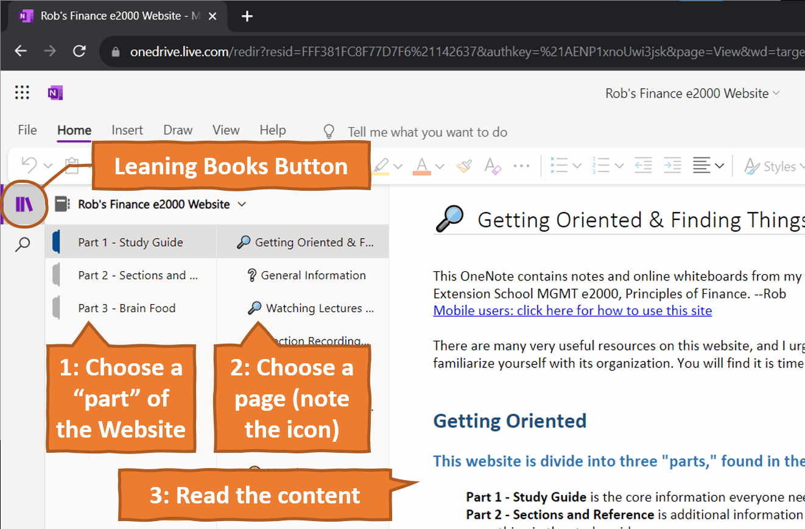

+++
title = 'Getting Oriented'
date = 2023-10-09T01:12:26-04:00
draft = false
bookToC = false
+++

# Getting Oriented & Finding Things

[Mobile users: click here for how to use this site](https://scholar.harvard.edu/robmunger/mobile).  
**My Email**: rob.mgmte2000@gmail.com (about anything!)  
**This site**: [robmunger.com/2000](https://robmunger.com/2000)  
**Condensed slides and Formula Sheet**: [robmunger.com/2000share](https://robmunger.com/2000share)  
"🔎 Section Information" can be found in the sidebar to the left.

This website contains notes and online whiteboards from my weekly sections for Harvard Extension School MGMT e2000, Principles of Finance. 

There are many very useful resources on this site, and I urge you to take a moment to familiarize yourself with its organization. You will find it is time very well spent!

# This website is divided into three "parts," found in the left-hand navigation. 
  
>**Part 1 - Study Guide** has the *core information* that is directly relevant to this class. You are currently in this part.  
>**Part 2 - Sections and Reference** has *additional* information that is directly relevant to this class -- in case you can't find something in the study guide.   
>**Part 3 - Brain Food and Paper Topics** has information about how these ideas are applied *mostly beyond this class*.   
  
  
Which parts will be relevant to you?  
- _**Part 1**_ is meant to be helpful to *every* student in the class.  
- If your finance background isn't as strong and/or it has been a while since you've been in school, you may find it helpful to attend both weekly sections. _**Part 2**_ provides additional resources to support your learning and are meant for section attendees and anyone who is looking.  
- Finance is extremely competitive. At the highest levels, people tend to cultivate their curiosity because a broad perspective increases people's confidence in you. _**Part 3**_ helps provide complementary context and applications that can help you "feed your brain."  
  
  
# Each of the three parts has different types of pages, indicated by icons:  
  
**Part 1 - Study Guide** primarily has four types of pages:  
> 👨‍🏫 = Notes on a lecture  
> ✏ = Practice problems  
> ❔ = Frequently Asked Questions and answers (FAQs)  
> 🔎 = Deep Dive into a common question or other important topic  
  
  
**Part 2 - Sections and Reference** adds two more types:  
>🙋=Office Hour questions and section agendas  
>✔= Helps you find the section recording when we reviewed problem set or exam solutions (after the due date)  
>  
  
**Part 3 - Brain Food and Paper Topics** adds a seventh type of page:  
>📰, 📚, or 🧠=Brain Food/Applications/possible paper topics  
  
  
Quote from Nick C, an e2000 alum:  
>"*The portions of OneNote that I found most helpful are the practice problems. This helps greatly when doing the homework. I also find great value in downloading/printing the *[*condensed slides*](https://robmunger.com/2000slides)*. This saves a few trees. I find your site to be EXTREMELY helpful for this class, and I appreciate your fun section reviews.*" \[Note: pages with practice problems have a ✏️ icon.]  
  
  
# Earlier lectures are at the top; later lectures at the bottom 
  
Just like every problem set and exam question goes back to one of Bruce's lectures, each page on this website is based on a specific lecture. In each of the three parts of the site, pages are organized chronologically, based on the Lecture number. Earlier lectures are at the top and later lectures are at the bottom.  
  
# Use the menus on the left to find the page you want 
  
To use this study guide, please explore the menus to the left:  
(you can click the "Leaning Books" icon to hide or display navigation menus)  
  
  
  
You can always get back to this site by bookmarking the following link: [https://robmunger.com/2000](https://robmunger.com/2000)  
  
# Explore to learn!  
  
↖ Why don't you take a moment to explore the menus on the left? Can you find and navigate to the pages on "❔  General Information," "🔎  Study Tips," and "🔎  Frequently Asked Questions?" If not, drop me a line at [rob.mgmte2000@gmail.com](http://rob.mgmte2000@gmail.com) and I will be happy to help!  
  
# Table of Contents  
  
I've made a "Table of Contents" page, but I'm hoping you will find it more convenient to use the leaning books icon and the left-hand navigation menus, as described above. If you find it more convenient to use the Table of Contents page, please let me know why! ([rob.mgmte2000@gmail.com](http://rob.mgmte2000@gmail.com) or <a href="https://robmunger.com/2000feedback">here</a>.)  
  
Click here to visit the Full-Site Table of Contents  
  
  
This site © 2023 Robert Munger. All rights reserved. Please do not copy or redistribute.  
  