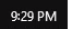
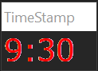

+++
title = 'Sections'
date = 2023-10-09T09:41:18-04:00
draft = false
+++
# 🔎  Sections
[Mobile users: click here for how to use this site](https://scholar.harvard.edu/robmunger/mobile)  
  
# Schedule: (Fall 2023) 📅  
  
- **Saturdays**, 12:30-2:30 PM eastern time (ET)  
- **Mondays**, 7:30-9:30 PM eastern time (ET)   

The two sections cover different material, with Monday sections building on Saturday sections.  
- **Saturday** sections provide a more comprehensive overview of the most important new ideas from Tuesday's lecture.  
- **Monday** sections focus on student questions and "mop up" any remaining topics. They may be short if there are few student questions.  
- If there is a **problem set**, I encourage you to attempt to finish the problem set between the two sections. Saturday will be designed to give you the most important tools you'll need for the problem set, and Monday will focus on questions that come up as you are working. If you get stuck with a problem, email questions to rob.mgmte2000@gmail.com, ideally by Monday morning.  
  
  
  
# General Information  
  
>- Email office hours questions to [rob.mgmte2000@gmail.com](mailto:rob.mgmte2000@gmail.com)  
>- To participate in live sections or watch recorded sections, visit 🔎  Watching Lectures and Sections.   
>- If possible, please bring **pencil, paper, and a calculator or spreadsheet app**. **Practice problems** are vital because you may think you understand something, but you never know for sure until you’ve tried it with your own hand. Watching someone else do practice problems is about as effective as watching someone else do physical exercise 💪.  
>- We only have sections when there is **new material** to cover (not before the first lecture, after exams, or during vacation weeks).  [Click here](https://canvas.harvard.edu/courses/131152)🔗 to join section or to watch a recording.  
  
  
  
# Using this website with sections  
  
First and foremost, this website is just a way of sharing quick notes and documents from my live sections. I use icons to indicate the following materials we use during sections:  
  
>✅ = Section agenda  
>🙋 = Office hours questions  
>✏ = Practice problems  
>❔ = Frequently Asked Questions  
>🔎 = Deep dives  
>✔ = TimeStamps when we cover problem set solutions (see below)  
  
  
 Visit Getting Oriented &amp; Finding Things to see how to find these resources.  
  
You can always reach this website going to [robmunger.com/2000](http://robmunger.com/2000) on any device. You don't need any special software to view it - just a regular web browser like Chrome or Safari. On devices with small screens, you might need to click the "leaning book" icon to hide the sidebar:  
  
  
Tap it again to switch to another page.  
  
  
# TimeStamps  
  
When we cover Office Hour questions and problem set solutions, I mark the relevant page on this website with a "TimeStamp:"  
:o: (TimeStamp - 9:29 PM in the Sept 1 recording)  
  
The above timestamp means that we covered the material below it at 9:29 PM in the section recording from September 1.  
  
If you see a TimeStamp on this website, you can track down the corresponding discussion in the recorded video. For the TimeStamp above, you would open the recording from the section on September first. Scan forward to the point in the recording when the clock in the bottom left of my screen read:  
  
  
The following window may also be visible on the right of my screen:  
  
  
  
  
# Sections when we covered Problem Set and Midterm solutions*  
  
Reviewing problem set solutions soon after the due date is a great way to reinforce concepts and learn from your mistakes. When time permits, we review *complete* solutions in the week after the due date. Links to pages with dates and timestamps when problem sets were reviewed are below:  
>- Links to solutions reviews for the Problem Sets will appear here.  
  
  
  
# Dark Mode  
  
During section, we use the OneNote backend for this website in dark mode. Some students find it easier on their eyes and find that it helps them fall asleep more easily after evening sections (this is [supported by science](https://www.foundmyfitness.com/episodes/early-day-light-for-improved-sleep)).  
  
In contrast, the companion web-site will have a white background. Rest assured that this website contains all of the material that I typed into OneNote during section. In fact, as I type and draw on the digital blackboard, it typically appears on this website within 30 seconds.  
  
If you have any other questions, just ask! You can reach me at rob.mgmte2000@gmail.com.  

  

| A |
| :--- |
| # **Read next for Lecture 1** | 
| Study Guide \| <a href="onenote:Part%202%20-%20Sections%20and%20Reference.one#LECTURE 1 Introduction - Sections and Reference&amp;section-id={FBC0C77D-B2A5-49FD-AB18-986FB6822009}&amp;page-id={FB9CCC6F-4E8D-44DF-A98E-F597C19E5F21}&amp;end&amp;base-path=https://d.docs.live.net/fff381fc8f77d7f6/Documents/OneNote/HES%202000%20Finance/Rob's%20Finance%20e2000%20Website">Sections and Reference</a> \| <a href="onenote:Part%203%20-%20Brain%20Food%20and%20Paper%20Topics.one#LECTURE 1 Intro - Brain Food&amp;section-id={AD5E080F-E813-418B-BB30-71C0F28AFAF0}&amp;page-id={1079A023-8783-4FE9-98C8-71086AE5D44B}&amp;end&amp;base-path=https://d.docs.live.net/fff381fc8f77d7f6/Documents/OneNote/HES%202000%20Finance/Rob's%20Finance%20e2000%20Website">Brain Food</a>  
How to Use This Site \| <a href="onenote:#🔎  Full Site Table of Contents&amp;section-id={77FB40E2-E50D-4389-BF28-88A291C6B455}&amp;page-id={47B17CF1-80D6-453A-B79D-E46766899904}&amp;end&amp;base-path=https://d.docs.live.net/fff381fc8f77d7f6/Documents/OneNote/HES%202000%20Finance/Rob's%20Finance%20e2000%20Website/Part%201%20-%20Study%20Guide.one">Full Site Table of Contents</a> | 
  
#   

