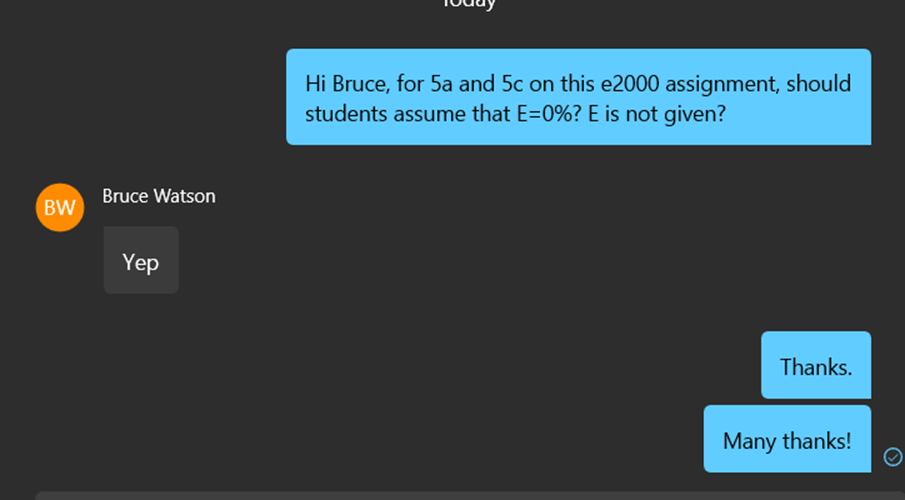

##  Favorite Commands

* Hugo new content path
* Hugo server
* jdx, where x is a number ⇨ \\$x
* Use this to insert shortcodes for a solution box:
  * Solution:
  * <blah blah>✅

* Use these to insert shortcodes for 🟢highlighting🟩:
  * 🔴🟠🟡🟢🔵🟣🟤⚫⚪
  * 🟥🟧🟨🟩🟦🟪🟫⬛⬜
  * ❤️🧡💛💚💙💜🤎🖤🤍
  * 🔶🔷
  * 🔸🔹

## Todo

* Why are my archetypes not working properly?
* Can I get KaTeX to work?
* Can I get this on github in a private repo?
* 

## How to reproduce

* [Follow Hugo's Quick Start](https://gohugo.io/getting-started/quick-start/)
* Add [hugo-book](https://github.com/alex-shpak/hugo-book) and/or [docsy](https://www.docsy.dev/)
* Add KaTeX just like [Misha did](https://misha.brukman.net/blog/2022/04/writing-math-with-hugo/).

## Links

* [The most powerful: docsy](https://www.docsy.dev/)
* https://getdoks.org/
* [12 hugo documentation themes from cloudcannon](https://cloudcannon.com/blog/twelve-amazing-free-hugo-documentation-themes/)
* [Shadocs](https://shadocs.netlify.app/functionalities/sidebar/)

✏️ The balance sheet of First National Bank is below. E=0%. What is R?

| Assets                                                       | Liabilities                               |
| ------------------------------------------------------------ | ----------------------------------------- |
| ? Reserves      ﹩5M Vault Cash🟢    ﹩30M Deposits at Fed | ? Deposits  Bank Capital = \$5. |



**Start** *with* the balance sheet: 
$$
﹩TotalReserves = Vault Cash+DaF =﹩5M🟢+﹩30M=﹩35M
$$
We then apply that the balance sheet must balance:
$$
Assets=Liabilities+BankCapital
$$

$$
﹩155=Deposits + ﹩5M
$$



